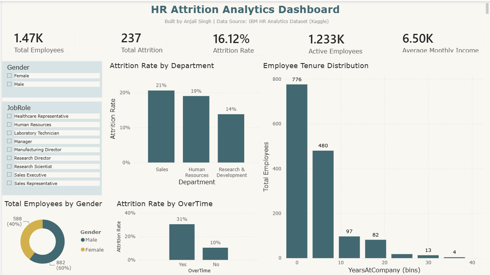

# HR Attrition Analytics Dashboard

An interactive dashboard analyzing employee attrition patterns using the IBM HR Analytics dataset, built to identify the key drivers of employee turnover and support HR decision-making.

**Live Interactive Dashboard:** [View it here](https://datastudio.google.com/reporting/d723e0be-d218-4740-a6e0-5cae3ee8284f)

## Business Question

Why are employees leaving, and which factors correlate most strongly with attrition? This analysis breaks down attrition by department, overtime status, and tenure to surface actionable patterns for HR and leadership.

## Tools Used

- Power BI Desktop — data modeling, DAX measures, primary dashboard build
- Power Query — data cleaning and transformation
- Google Looker Studio — published interactive version for public sharing
- DAX — Attrition Rate, Average Tenure, Average Monthly Income measures

## Dataset

IBM HR Analytics Employee Attrition & Performance dataset (public, via Kaggle) — 1,470 employee records across Sales, HR, and R&D departments.

## What I Did

1. Cleaned and prepared the raw dataset in Power Query — fixed data types, removed constant/unused columns, checked for nulls
2. Built a data model and 5 core DAX measures: Total Employees, Total Attrition, Active Employees, Attrition Rate, Average Monthly Income
3. Designed an interactive dashboard with KPI cards, department and overtime breakdowns, a tenure distribution chart, and live filters for Gender and Job Role
4. Published an interactive version to Looker Studio for public, no-login access

## Key Findings

**1. Overtime is the strongest predictor of attrition in this dataset.**
Employees working overtime had a ~31% attrition rate, compared to just ~10% for those who didn't — roughly 3x higher. This is the single clearest signal in the data and would be the first place I'd recommend HR investigate (workload distribution, burnout risk, compensation for overtime).

**2. Sales has the highest departmental attrition rate (~21%)**, followed by HR (~19%) and R&D (~14%) — worth examining whether this ties to overtime patterns within Sales specifically.

**3. Attrition is heavily concentrated in early tenure.** Most attrition happens within the first 5 years, with a sharp drop-off after year 10 — suggesting retention efforts may have the highest impact if focused on newer employees.

## Dashboard Preview

## Files in This Repository

- `Power BI report.pbix` — Power BI source file
- `HR Attrition Dashboard.pdf` — Static PDF export
- `dashboard-preview.png` — Dashboard screenshot

---

Built by Anjali Singh — [LinkedIn](https://www.linkedin.com/in/anjali-singh-6a92b1189) | [Live Dashboard](https://datastudio.google.com/reporting/d723e0be-d218-4740-a6e0-5cae3ee8284f)
